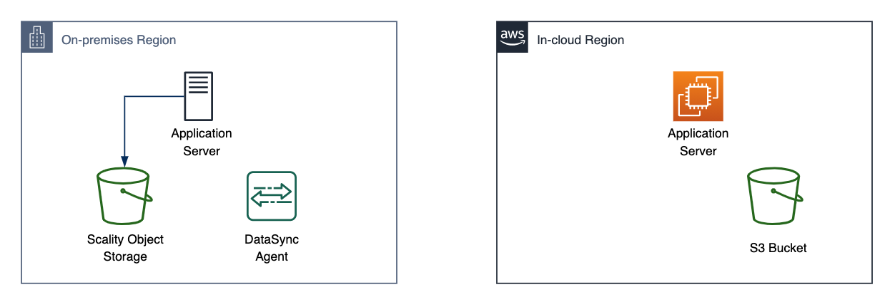
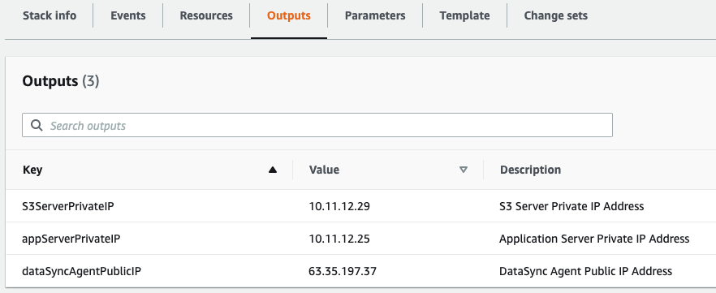
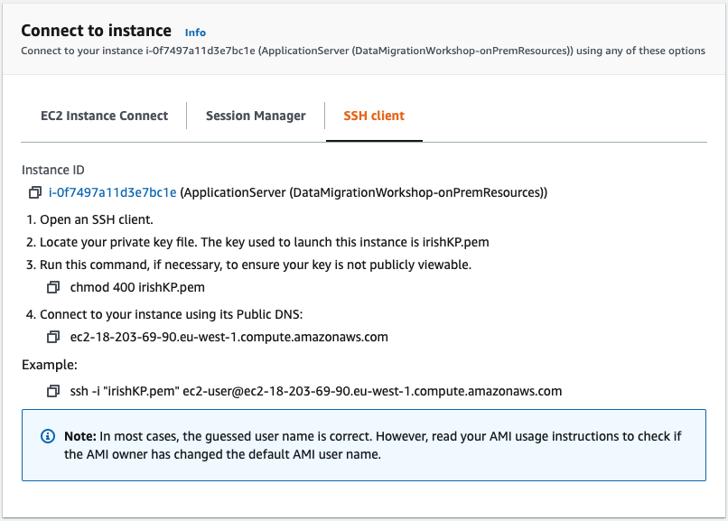
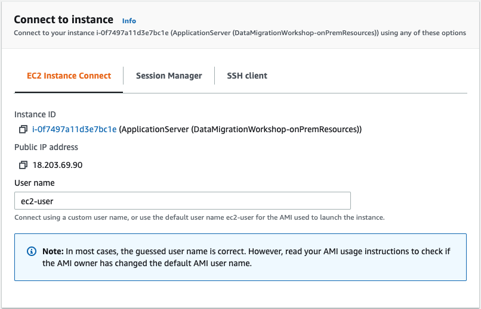
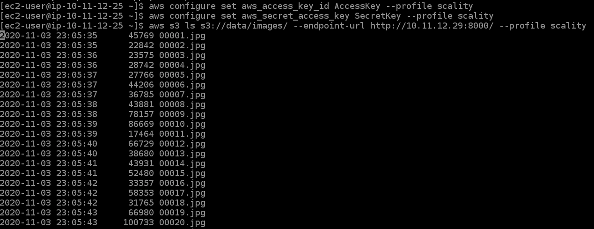

# **AWS DataSync**

### Object storage migration using AWS DataSync from Scality to Amazon S3

© 2019 Amazon Web Services, Inc. and its affiliates. All rights reserved.
This sample code is made available under the MIT-0 license. See the LICENSE file.

Errors or corrections? Contact [jeffbart@amazon.com](mailto:jeffbart@amazon.com).

---

# Module 1
## Deploy resources in the on-premises and in-cloud regions

In this module, you will use CloudFormation scripts to deploy resources in two AWS regions: one that represents the on-premises environment, and one for the in-cloud environment.  Once all resources have been deployed, you will access the data on Scality from the Application server and verify existing objects.

## Module Steps

#### 1. Deploy AWS resources for the on-premises region

1. Click one of the launch links in the table below to deploy the **on-premises** resources using CloudFormation.  To avoid errors during deployment, select a region in which you have previously created AWS resources.

  | **Region Code** | **Region Name** | **Launch** |
  | --- | --- | --- |
  | us-west-1 | US West (N. California) | [Launch in us-west-1](https://console.aws.amazon.com/cloudformation/home?region=us-west-1#/stacks/new?stackName=DataMigrationWorkshop-onPremResources&amp;templateURL=https://aws-datasync-samples.s3-us-west-2.amazonaws.com/workshops/object-migration/data-migration-workshop-on-prem.yaml) |
  | us-west-2 | US West (Oregon) | [Launch in us-west-2](https://console.aws.amazon.com/cloudformation/home?region=us-west-2#/stacks/new?stackName=DataMigrationWorkshop-onPremResources&amp;templateURL=https://aws-datasync-samples.s3-us-west-2.amazonaws.com/workshops/object-migration/data-migration-workshop-on-prem.yaml) |
  | us-east-1 | US East (N. Virginia) | [Launch in us-east-1](https://console.aws.amazon.com/cloudformation/home?region=us-east-1#/stacks/new?stackName=DataMigrationWorkshop-onPremResources&amp;templateURL=https://aws-datasync-samples.s3-us-west-2.amazonaws.com/workshops/object-migration/data-migration-workshop-on-prem.yaml) |
  | us-east-2 | US East (Ohio) | [Launch in us-east-2](https://console.aws.amazon.com/cloudformation/home?region=us-east-2#/stacks/new?stackName=DataMigrationWorkshop-onPremResources&amp;templateURL=https://aws-datasync-samples.s3-us-west-2.amazonaws.com/workshops/object-migration/data-migration-workshop-on-prem.yaml) |
  | eu-west-1 | Ireland | [Launch in eu-west-1](https://console.aws.amazon.com/cloudformation/home?region=eu-west-1#/stacks/new?stackName=DataMigrationWorkshop-onPremResources&amp;templateURL=https://aws-datasync-samples.s3-us-west-2.amazonaws.com/workshops/object-migration/data-migration-workshop-on-prem.yaml) |
  | eu-central-1 | Frankfurt | [Launch in eu-central-1](https://console.aws.amazon.com/cloudformation/home?region=eu-central-1#/stacks/new?stackName=DataMigrationWorkshop-onPremResources&amp;templateURL=https://aws-datasync-samples.s3-us-west-2.amazonaws.com/workshops/object-migration/data-migration-workshop-on-prem.yaml) |

2. Click **Next** on the Create Stack page.
3. If you want to access EC2 instances created in this workshop using your local SSH client then enter the name of an EC2 key pair in your selected region.  Otherwise, you can leave the key pair blank.
3. Click **Next**.
4. Click **Next**.
5. Click **Next** again. (skipping the Options and Advanced options sections)
6. On the Review page, scroll to the bottom and check the box to acknowledge that CloudFormation will create IAM resources, then click  **Create stack**.

**Note:** Instances that are launched as part of this CloudFormation template may be in the initializing state for few minutes.

While the CloudFormation deployment progresses in the on-premises region, you can proceed to deploy resources for the in-cloud region.

#### 2. Deploy AWS resources for the in-cloud region

1. Click one of the launch links in the table below to deploy the **in-cloud** resources using CloudFormation.  Use a different region from the on-premises region.  To avoid errors in deployment, select a region in which you have previously created AWS resources.

  | **Region Code** | **Region Name** | **Launch** |
  | --- | --- | --- |
  | us-west-1 | US West (N. California) | [Launch in us-west-1](https://console.aws.amazon.com/cloudformation/home?region=us-west-1#/stacks/new?stackName=DataMigrationWorkshop-inCloudResources&amp;templateURL=https://aws-datasync-samples.s3-us-west-2.amazonaws.com/workshops/object-migration/data-migration-workshop-in-cloud.yaml) |
  | us-west-2 | US West (Oregon) | [Launch in us-west-2](https://console.aws.amazon.com/cloudformation/home?region=us-west-2#/stacks/new?stackName=DataMigrationWorkshop-inCloudResources&amp;templateURL=https://aws-datasync-samples.s3-us-west-2.amazonaws.com/workshops/object-migration/data-migration-workshop-in-cloud.yaml) |
  | us-east-1 | US East (N. Virginia) | [Launch in us-east-1](https://console.aws.amazon.com/cloudformation/home?region=us-east-1#/stacks/new?stackName=DataMigrationWorkshop-inCloudResources&amp;templateURL=https://aws-datasync-samples.s3-us-west-2.amazonaws.com/workshops/object-migration/data-migration-workshop-in-cloud.yaml) |
  | us-east-2 | US East (Ohio) | [Launch in us-east-2](https://console.aws.amazon.com/cloudformation/home?region=us-east-2#/stacks/new?stackName=DataMigrationWorkshop-inCloudResources&amp;templateURL=https://aws-datasync-samples.s3-us-west-2.amazonaws.com/workshops/object-migration/data-migration-workshop-in-cloud.yaml) |
  | eu-west-1 | Ireland | [Launch in eu-west-1](https://console.aws.amazon.com/cloudformation/home?region=eu-west-1#/stacks/new?stackName=DataMigrationWorkshop-inCloudResources&amp;templateURL=https://aws-datasync-samples.s3-us-west-2.amazonaws.com/workshops/object-migration/data-migration-workshop-in-cloud.yaml) |
  | eu-central-1 | Frankfurt | [Launch in eu-central-1](https://console.aws.amazon.com/cloudformation/home?region=eu-central-1#/stacks/new?stackName=DataMigrationWorkshop-inCloudResources&amp;templateURL=https://aws-datasync-samples.s3-us-west-2.amazonaws.com/workshops/object-migration/data-migration-workshop-in-cloud.yaml) |

2. Click  **Next**  on the Create stack page.
3. Click **Next** (there are no stack parameters) **.**
4. Click  **Next**  again. (skipping the Options and Advanced options sections)
5. On the Review page, scroll to the bottom and check the box to acknowledge that CloudFormation will create IAM resources, then click  **Create stack**.

Wait for the CloudFormation stacks in each region to reach the CREATE\_COMPLETE state before proceeding to the next steps.  It should take about 10 minutes for both CloudFormation stacks to complete.

**NOTE:** If a stack fails to deploy because an EC2 instance type is not available in a particular availability zone, delete the stack and retry in the same region or in a different region.

#### 3. Stack Outputs

Upon completion, each CloudFormation stack will have a list of &quot;Outputs&quot;.  These are values such as IP addresses and resource names that will be used throughout the workshop.  You can either copy these values elsewhere or keep the page open in your browser and refer to them as you go through the workshop.

On the CloudFormation page in the **on-premises** region, click on the **Outputs** tab, as shown in the image below.  You should see four values listed:

- **appServerPrivateIP** – This is the private IP address of the Application Server.  You will use this to demonstrate access to the objects on both on-premises and in-cloud environments.
- **dataSyncAgentPublicIP** – This is the public IP address of the EC2 instance running the DataSync agent.  You will use this when activating the DataSync agent.
- **S3ServerPrivateIP** – This is the public IP address of the EC2 instance running the Scality/Zenko object store.  You will use this when accessing the objects.

  

On the CloudFormation page in the **in-cloud** region, click on the **Outputs** tab as shown in the image below.  You should see two values listed:

- **bucketName** – This is the name of the S3 bucket where the data will be copied to.  You will use this when creating a file share on the File Gateway.
- **bucketRoleForDataSync** – This is the role that will be used by the DataSync agent to write files to the S3 bucket.  You will use this when creating the S3 location for DataSync.

  

#### 4. Connect to the Application server

1. From the AWS console in the **on-premises** region, click  **Services**  and select  **EC2.**
2. Select  **Instances**  from the menu on the left.
3. Right-click on the **ApplicationServer** instance and select  **Connect** from the menu.

If you configured an EC2 Key Pair when you deployed the on-premises CloudFormation template, then you can connect using an SSH client from your computer:

  

Otherwise you can connect to the instanct directly through your browser using either EC2 Instance Connect or Session Manager:

  

If using EC2 Instance Connect or Session Manager, click **Connect**.  A new tab will be opened in your browser with a command line interface (CLI) to the Application server. Keep this tab open - you will use the command line on the Application server throughout this workshop.

## Validation Step

In the CLI for the Application server, run the following commands to verify the files on the object store.  Use the **S3ServerPrivateIP** value from the **on-premises** CloudFormation stack output.

    $ aws configure set aws_access_key_id AccessKey --profile scality
    $ aws configure set aws_secret_access_key SecretKey --profile scality
    $ aws s3 ls s3://data/images/ --endpoint-url http://<S3ServerPrivateIP>:8000/ --profile scality
    $ aws s3 ls s3://data/images/ --endpoint-url http://<S3ServerPrivateIP>:8000/ --profile scality | wc -l

In the bucket s3://data images folder you should see 200 image objects, as shown below.  These images represent the object store data that will be migrated to the S3 bucket in the in-cloud region.

## Module Summary

In this module, you deployed all of the resources necessary to complete this workshop in both the on-premises region and the in-cloud region.  You have also accessed the on-premises object store from the Application server and verified your data set.

In the next module, you will create a DataSync task to do an initial copy of files from the Scality to the AWS S3 bucket.

Go to [Module 2](../module2/).
